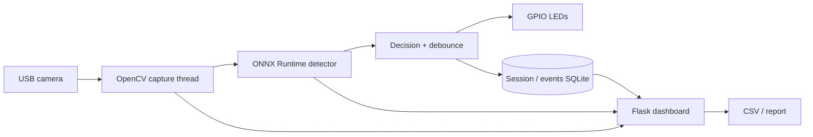

# Architecture

```mermaid
flowchart LR
  CAM[USB camera] --> CAP[OpenCV capture thread]
  CAP --> DET[ONNX Runtime detector]
  DET --> DEC[Decision + debounce]
  DEC --> LED[GPIO LEDs]
  DEC --> DB[(Session / events SQLite)]
  CAP --> WEB[Flask dashboard]
  DET --> WEB
  DB --> WEB
  WEB --> REP[CSV / report]
```
Update this file if you change the pipeline.
